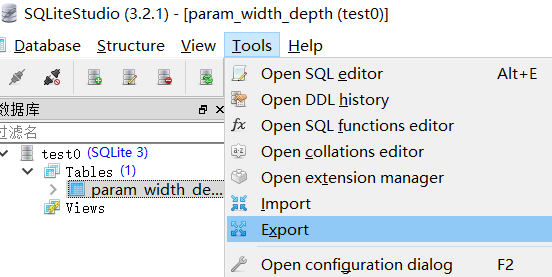

# Readme

## index.html

- page init

First hide everything except the network architecture input column and network architecture heading. Second update database to load data. Third initialize inputObject class so all values are empty. Fourth display network architecture column based on available network architecture.

- display input column by column. 

On change of one input column, first clear all content displayed  on the page, then update inputObject class's data( it reads data from the present website choices). finally display the heading and display all data of the next column from the information stored in inputObject class.

- display number of parameters

When both depth and width are selected by the user, display available number of parameters in the list{width, depth, num_of_param}

Every input column has its own id, so we can get them in js files.

- display visualize button

On change of the body content, check if the user clicked just enough options. If so, display visualize button.

- display graphs

Once the visualize button is pressed, show graphs.

- display available options

Add child to every parent id. Then set attributes.

## js

### DisplayInputByInput

display and hide object to achieve dynamic input display.

display_xxx: display xxx input column based on available experimented data

display_available_xxx: set all attributes on html

clear_xxx: make xxx input column none or hidden

clear_after_xxx: When one column xxx is changed by the user, clear all columns after xxx. 

### inputObject

store user input and can update itself based on current website input.
- Need to define the relationship between (width, depth) and number of parameters here
- Compare functions, used by sort functions
- Color map for plots

### PlotResults.js

- Functions to plot figures

### WebSql.js

- Create the WebSql DB containing available parameters
- Contains functions to execute SQL statements and SQL files

### WebSqlOperations.js

- Contains functions to search available parameters in the DB

### Util.js

- Some tool functions

## sql

Here's the table definition files of the database. We use two tables to describe the database of "available parameters". The table of "param_ensemble" represent the relationship with the network type, dataset and ensemble type, ensemble size. The other table is "param_width_depth", represents the relationship between the network type, dataset and depth, width. (network type, dataset) is the main key of both table here.

The reason that we design it like this is that data in table "param_ensemble" are to do with how many group of figures we should plot, while data in the table "param_width_depth" defines the possible "width" of our plots.

## data

Here's the JSON files used to plot all the figures. The folders and files are directly pasted from Utils/data/json_output/ of our python data preprocessing project.

As for detailed JSON file format, please check data/Readme.md.

# About Adding Plots

Here's how we do to add a new plot.

1. In Utils/GenerateJson.py, write a function csv_to_json_some_kind_of_plot() to  extract useful information from the raw experiment results, save it into json files which are used to plot figures. There are 3 folders under Utils/data/json_output/, each folder corresponds to one type of figure. So if you want to add extra figures, please create a corresponding folder under Utils/data/json_output/ .
2. In Utils/GenerateJson.py, call the function defined just now to all_jsons() function.
3. Run Utils/GenerateJson.py to get the JSON.
4. Copy all folders under Utils/data/json_output to WebProject/data/ .

5. Create a plot_some_kind_of_plot() function in WebProjet/js/PlotResults.js, the parameter of which is 

- the label of div to plot this figure, 
- ensemble type
- ensemble size

6. Substitute old plots: Currently the visualization canvas (div) contains multiple lines, the function plot_one_line() and plot_all_lines in PlotResults.js describe that. Function plot_one_line() append some div dynamically to the page and plot some figures in this line. If you want to substitute the old figures with new ones, just substitute the plot_old_figure() function with your new plot_some_kind_of_plot() at the bottom of plot_one_line().

7. Add extra plots: Create the second plot line function called plot_the_second_line(), and describe the new canvas here. At the end of this function, call the function plot_some_kind_of_plot() and set the label argument to what is newly created. Then modify plot_all_lines() function, append plot_the_second_line() after every plot_one_line().

# About Adding Datasets

We need to use the python preprocessing project called "Utils" to finish this task.

1. Download the data.rar, unzip it an put it this folder under the root path of "Utils". 

2. Put your result folder in a proper place under Utils/data/raw_data/. For example, now you have a series of result folders, from "gr_12_d_40_e_4_cifar10_vgr" to "gr_48_d_112_e_4_cifar10_vgr". The proper place to put these folders is Utils/data/raw_data/DenseNet/CIFAR-10/horizontal/4/ .

3. Horizontal folders don't contains single.csv. In order to simplify the processing procedure, we copy the single.csv file from it's corresponding vertical result folder. Run Utils/MoveSingle.py to do that.

4. Run GenerateJson.py to generate JSON files for plots. The results will be in data/json_output/ folder. Copy all folders under data/json_output/ to WebProject/data/

5. Run GenerateTableDefinition.py to generate data/table_def/TableDef-param_ensemble.sql.

6. Try to get the content of data/table_def/TableDef-param_width_depth.sql. This file is not generated by some module. The content of this file is the SQL exported from "data/table_def/test.db". In order to get the content of this file, open "data/table_def/test.db" with some SQLite GUI tools (eg. SQLiteStudio). There is only one table in text.db, which is "param_width_depth". Click some button like "export" to get the description SQL of this table. 

   

   Then paste the content manually to override TableDef-param_width_depth.sql file. After that, delete all the statements except:

   - drop table
   - create table
   - insert

   in this file. Then save and quit.

7. Copy two sql file under Utils/data/table_def to WebProject/sql/ .
8. We previously define the relationship between (width, depth) and number of parameters in WebProject/js/PlotResults.js. When add new datasets, please add corresponding new terms here. Be sure that they are correctly sorted by the number of parameters.

Done
